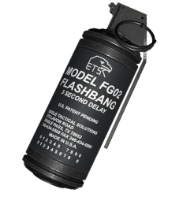
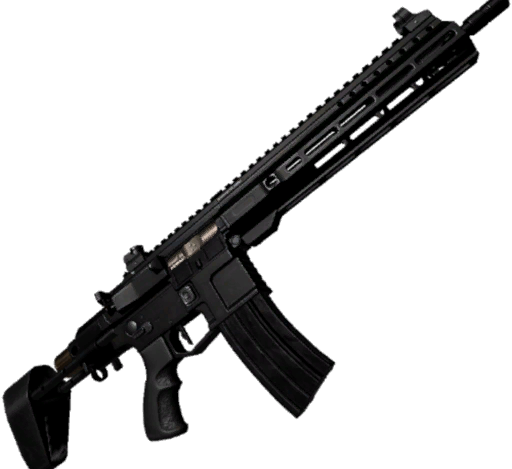
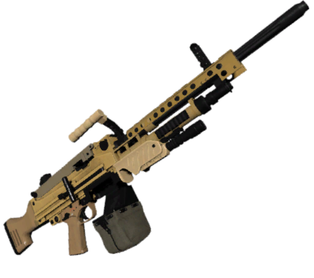
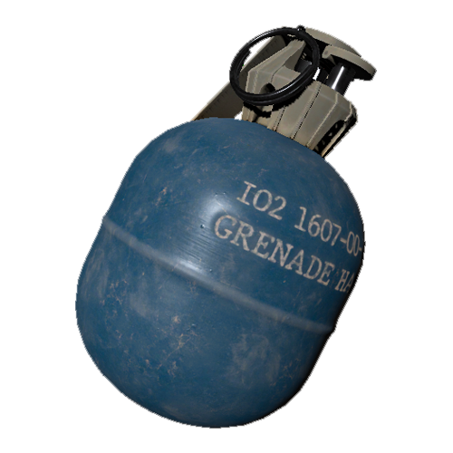

# Les Objets Personnalisés

## Grenade IEM :

---

Une grenade qui supprime l'énergie de la salle ce qui permet d'ouvrir les portes et d'éteindre les lumières. 

!!! warning "Objet désactivé"
    Cet objet est actuellement désactivé et n'apparaît pas naturellement. Il est néanmoins toujours disponible via la RA.

## Fusil de sniper :

---

Un fusil qui permet de tuer facilement une cible avec énormément de vie. En revanche, elle se recharge lentement.

## Lance grenade :

---

Une arme qui permet de lancer des grenades sur vos ennemies. Faite attention, vous pourriez vous faire très mal.

## Grenade à implosion :

---

Une grenade qui ne fait pas de dégâts, mais qui attire les joueurs en son centre d'explosion. 

## Tranquillisant :

---

Une arme qui fait peu de dégâts, mais qui permet de rendre votre ennemi hors de combat quelques secondes. 

!!! warning "Objet désactivé"
    Cet objet est actuellement désactivé et n'apparaît pas naturellement. Il est néanmoins toujours disponible via la RA.