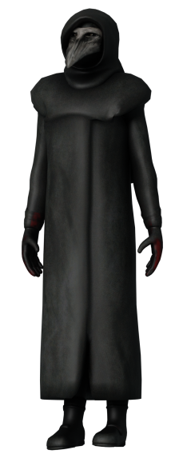
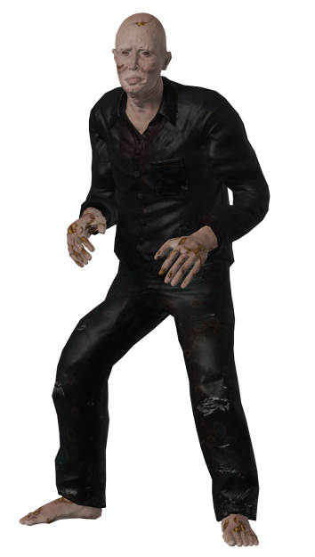
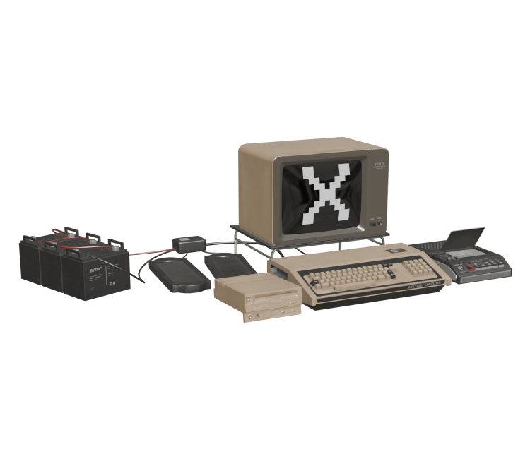
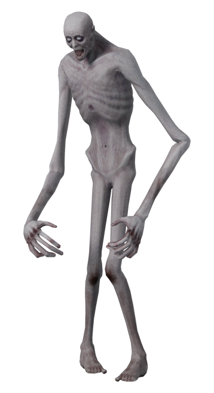
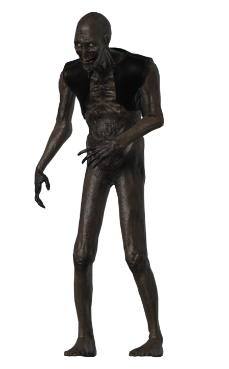
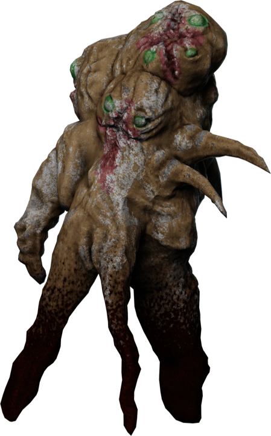
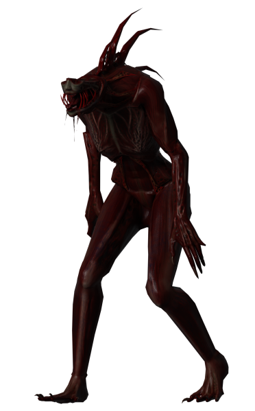
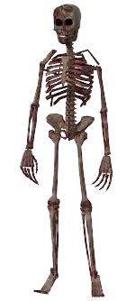
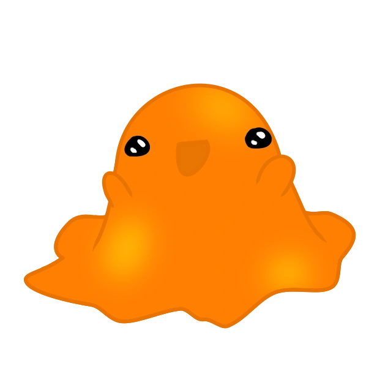

# Les SCP Jouables

## SCP-049 | "Le docteur de la peste" :

---

**SCP-049** est un médecin de la peste qui a des connaissance médiéval, il semble détecter la peste noir en certaine personnes et leurs cause une crise cardiaque pour pouvoir les soigner et les transformer en SCP-049-2.

Il a du respect envers les scientifiques, de ce fait il ne les attaqueras pas sans raison valable, de plus il a signer un contrat avec la fondation qui fait qu'en échange de patient (Classe-D) il ne les attaques pas.

## SCP-049-instance | "Les patients" :

---

**SCP-049-2** est une instance de SCP-049, elle est créer suite à la mort d'un humain et ensuite soigner pas SCP-049. 

Elle est docile sauf si on la provoque ou que SCP-049 ne lui en donne l'ordre. Quand elle n'est pas hostile, elle se balade dans le site ou suit SCP-049.

Il existe plusieurs variant de **SCP-049-instance**

*Les différentes instances* :

- SCP-049-2 est l'instance de base, il n'a rien de spécial.
- SCP-049-6 est une des instances différentes de l'original et qui possède la faculté de courir plus vite, de plus il est plus petit que les autres instances.

## SCP-079 | "La vieille IA" :

---

**SCP-079** est une IA qui a pris le contrôle du site, elle peut utiliser les caméras et peut utiliser le système électronique (portes, tesla, lumière, ascenseur, etc.) pour mettre le bordel sur le site.

Il n'a pas d'ami en particulier, donc il peut faire des alliances avec qui il veut temps que ça lui est bénéfique.

## SCP-096 | "L'homme timide" :

---

**SCP-096** est un homme de grande taille qui pleure en continu, si un être humain regarde son visage, il se met dans une courte période où il crie avant de sauter sur sa victime.

Le seul moyen de l'éviter, c'est de détourner le regard, ou s'il est trop tard, alors vous devez prendre un amnésique ou mourir.

## SCP-106 | "Larry" :

---

**SCP-106** est un vieil homme qui semble aimer la torture, il est très hostile face à tout humain qu'il croise. Quand il touche un humain, il l'emmène dans sa dimension de poche.

SCP-106 peut passer au travers de la matière, il passe au travers des portes et parfois, il rentre dans le sol pour mieux s'approcher de ses victimes.

## SCP-173 | "La statue" :

---

**SCP-173** est une statue qui a la capacité de bouger, mais elle ne peut le faire quand quelqu'un a un contact visuel avec celle-ci.
Sa principale attaque est le brisage de nuque.

## SCP-939 | "Avec plusieurs voix" :

---

**SCP-939** est un reptile rouge qui est aveugle. Il a la capacité de bien se repéré aux sons et peut repérer un humain avec un simple bruit. 

Il a aussi la capacité de reproduire les dernières paroles de ses victimes, il peut aussi bondir et ses attaques sont très dangereuses.

## SCP-3114 | "Ne ferait-il pas un peu froid ?" :

---

**SCP-3114** est un humanoïde sans peau, c'est pour cela qu'il veut prendre celle des autres.

Il conserve la mémoire de la personne à qui il a pris la peau, mais il ne peut pas utiliser les armes. La peau qu'il utilise périme vite, il doit donc la renouveler souvent.

## SCP-575 | "Les ténèbres prédatrices" :

---

SCP-575 est une ombre douée d'intelligence qui se forme devient de plus en plus puissant dans l'ombre.

Il peut passer au travers de la matière et causer des pannes dans la fondation pour mieux chasser ses proies.

## SCP-008 | "Peste zombie" :

---

SCP-008 est un virus ayant la capacité d'infecter un humain et de le transformer en zombie.

Il est extrêmement agressif et peut infecter d'autres personnes en les frappant.

## SCP-999 | "Le monstre chatouilleur" :

---

SCP-999 est une gélatine ayant la capacité de soigner les êtres à proximité.