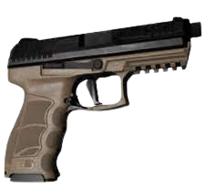

# Les SCP Objets

## Les SCP objets classiques :

## SCP-018 | "La super balle" :

---

Une balle rebondissante qui augmente sa vitesse à chaque rebond.

Après quelques secondes, elle devient si rapide qu'elle peut causer des dommages et détruire des fenêtres ou des portes.

Lorsqu'elle atteint sa vitesse maximale, elle explose comme une grenade après peu de temps, infligeant des dommages supplémentaires à tous ceux qui se trouvent à proximité.

Il est prouvé qu'elle est très efficace dans les petites pièces. 

## SCP-207 | "Le cola" :

---

Augmente votre vitesse de mouvement, mais draine lentement votre santé.

SCP-500 annulera l'effet plus tôt que prévu. 

**ATTENTION ! Combiner ce SCP avec SCP-207-A vous fera exploser.**

## SCP-207-A | "L'anti cola" :

---

Restaure les points de vie au fil du temps tout en accordant une "barrière temporaire", au prix d'une mobilité réduite. Il empêche la mort une fois, vous laissant avec un seul point de vie et vous retirer l'effet du SCP. Cela ne protègera pas contre l'ogive Alpha ou la décomposition dans la dimension de poche.

SCP-500 annulera l'effet plus tôt que prévu. 

**ATTENTION ! Combiner ce SCP avec SCP-207 vous fera exploser.**

## SCP-244 | "Les cendres de Grand-mère" :

---

Un vase qui, une fois ouvert, répand un épais brouillard. Ce dernier, en plus d'obscurcir la vue, ralentit les mouvements du joueur, qu'il soit SCP ou humain, tel que les attaques ou la saisie d'objet.

Après 5 secondes passées dans le brouillard, vous commencerez à perdre des PV, que vous soyez un SCP ou un humain.

SCP-244 apparait sous deux formes différentes : SCP-244A et SCP-244B, qui sont identiques dans leur fonctionnement.

## SCP-268 | "Chapeau de la négligence" :

---

Un chapeau qui rend son porteur invisible pendant quelques secondes.

N'affecte pas SCP-939 ou SCP-079, ainsi que SCP-096 lorsque vous l'avez regardé. Vous ne pouvez pas effectuer d'interactions ou prendre une arme dans votre main, sinon vous ne serez plus invisible. 

## SCP-330 | "N’en prenez que deux, s’il vous plaît" :

---

SCP-330 se situe en LCZ dans la salle TC-01. Il permet de récupérer plusieurs bonbons à effets différents. Attention, si vous prenez plus de deux bonbons, vos mains se couperont et vous mourrez. 

## SCP-500 | "Panacée" :

---

La panacée supprime tous les effets négatifs, vous soigne entièrement et lance une régénération rapide si vous êtes touché après l'avoir utilisée. 

## SCP-914 | "L'Horlogerie" :

---

Quand un objet est placé dans le compartiment d'entrée, une porte coulissante se ferme et le son d'une petite cloche retentit. Si l'interrupteur est tourné sur n'importe quelle position, SCP-914 "modifiera" l'objet dans le compartiment. 

## SCP-1576 | "Communicateur d'Outre-tombe d'Edison" :

---

SCP-1576 permettra au joueur de communiquer avec tous les spectateurs en même temps. Les joueurs n'utilisant pas SCP-1576 n'entendront pas les spectateurs à moins qu'ils ne se trouvent à moins de 7,5 mètres de SCP-1576 pendant son remontage. Un son peut être entendu par les spectateurs lorsque quelqu'un remonte SCP-1576, leur permettant de savoir que quelqu'un utilise l'objet. Un joueur qui parle actuellement via SCP-1576 verra l'icône de sa classe apparaître sur son indicateur de micro pour que les spectateurs puissent la voir.

## SCP-1853 | "Sérum vert" :

---

Un flacon qui, une fois utilisé, accélère les mouvements tels que la saisie d'objet ou la visée avec une arme et réduit le recul en tirant.

En contrepartie, vous utiliserez deux fois plus de stamina que d'habitude. Les effets peuvent s'accumuler si plusieurs SCP-1853 sont utilisés.

**ATTENTION ! Combiner ce SCP avec SCP-207 / SCP-207-A vous empoisonnera.**

## SCP-2176 | "Lumière fantôme" :

---

Après avoir été lancé, cette ampoule vous permet de faire un blackout dans une salle (comparable à celui de 079), éteindre une porte TESLA ou forcer l'arrêt d'un blackout. Son effet dure 15 secondes. 

Elle permet aussi de désactiver C.A.S.S.I.E / SCP-079 s'il se trouve dans la salle concernée.

## Les SCP objets moddé :

## SCP-119-OF | "Minigun à soins" :

---

SCP-119-OF est une FSP-9 aillant des attributs supplémentaires comme soigner ses alliés ou les instances de SCP-049 ou bien l'arme à la capacité comme toutes les armes de tuer ses ennemis. 

## SCP-127 | "L'arme vivante" :

---

SCP-127 est un SCP moddé, c'est une arme qui se recharge petit à petit ce qui vous permet de ne pas chercher de munition pour celui-ci. Cependant, SCP-127 permet seulement de tuer ses alliés.

## SCP-198 | "redacted" :

---

SCP-198 n'a pas d'apparence fixe, il peut prendre l'apparence de n'importe quel objet su site.
Si vous prenez SCP-198 par erreur, il se liera à vous, en plus de ne pas pouvoir utiliser l'objet, vous ne pourrez pas le retirer de votre inventaire à moins de mourir.

Vous avez 0.5% de chance que si vous prenez un objet, vous tombez dessus (il n'y en a que 1 par partie)

!!! warning "Objet désactivé"
    Cet objet est actuellement désactivé et n'apparaît pas naturellement.

## SCP-294 | "Machine à café" :

---

SCP-294 est une machine à café qui en échange d'une pièce, vous donne la boisson de votre choix (du sang, de l'eau, de l'antimatière, etc.).

## SCP-500-A-OF | "Amnésique" :

---

SCP-500-A-OF est une boîte de SCP-500 mélangé avec des amnésiques, ce SCP est capable de régler tous vos soucis, entre des SCP agressifs à un SCP-096 que vous avez malheureusement regardé.

## SCP-714 | "Anneau de jade" :

---

Même s'il a une apparence de pièce, SCP-714 est un anneau de jade qui quand vous le portez, vous immunise aux effets en échange d'un drainage de la santé.

## SCP-1499 | "Le masque à gaz" :

---

SCP-1499 est un masque à gaz qui vous permet, une fois porté de vous téléporter de façon temporaire dans une autre dimension.

Même s'il ressemble à SCP-268, il n'a pas les mêmes effets.

## SCP-3614-OF | "Bouclier pare-balle" :

---

SCP-3614-OF est un bouclier avec la capacité de renvoyer les balles de vos ennemis sur eux-mêmes.

## SCP-2461-B | "Armure exosquelettique motorisée" :

---

SCP-2461-B est une armure qui augmente la résistance de son hôte et lui diminue sa stamina.